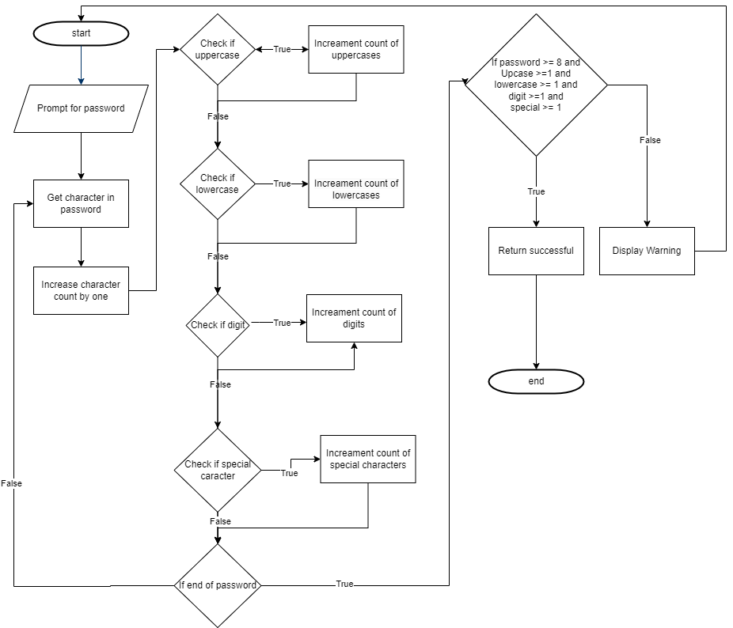

# Android Inventory App

This is an Android project using Java and SQL. The project is an inventory app used to track inventory. Users can register and login. After logging in, users can add, edit, and remove inventory. Users can also update quantities.

## Getting Started
To run this project, I recommend using Android Studio. The project uses Java and not Kotlin. The project is divided up into database handlers which handle interactions with the database and activity files which handle logic for the layouts.

## Version 1.1.0
Version two implements new security for password complexity. Passwords now require uppercase, lowercase, digits, special characters and a length of eight or more. See figure 1 for a diagram on how the logic works.

Figure 1.