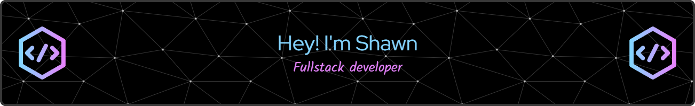
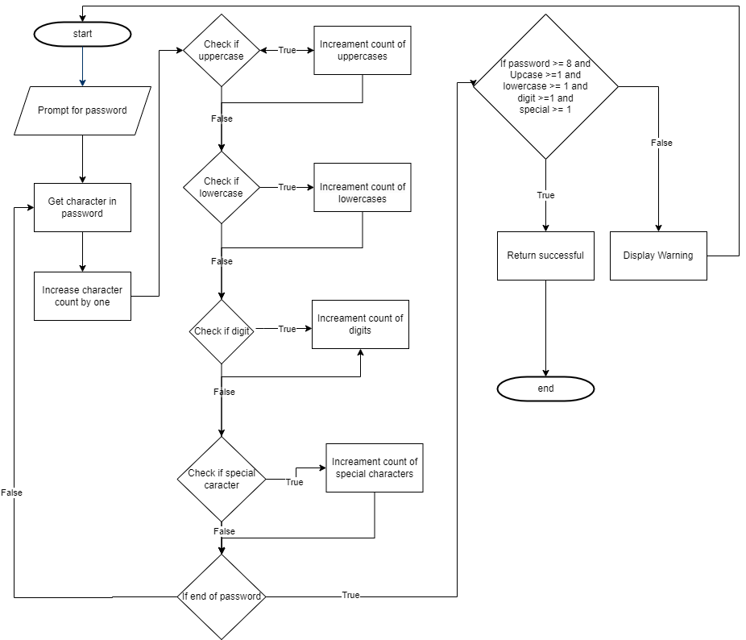

# Shawn's GitHub Page

Welcome to my ePortfolio! This portfolio outlines three areas of focus, including software design and engineering, algorithm and data structures, and databases. I’ve also included a code review of an application before enhancements were performed.

## Professional Self-Assessment 

I started my computer science journey during my junior year of high school 20 years ago. After high school, I attended a local community college where I completed an associate in Business and Information Technology degree. I then went on to start a degree in computer science but never finished. Last year, I decide to finish up my degree and decided on Southern New Hampshire University. This term will wrap up my computer science courses at SNHU and the next term will wrap the rest of my courses. I’ll have a few transfer courses to finish and transfer over.

I’ve also been working as a full stack developer for a credit union over the last eight years. During that time, I’ve worked on .NET, Java, Angular, and SQL projects.

One of the applications I’ve worked on includes a rewards program. I helped design and implement the underlying SQL database. We also had to design and admin portal and integrate the application into various banking systems. I’ve also worked with Jenkins to design and implement automation pipelines. These pipelines include automated testing, building, and deploying to various environments. Mentoring is something that’s important to me and I’ve had opportunities to help train new developers joining the team.

I’ve enjoyed my time here at SNHU. I like the quick pace of the terms although sometime longer deadlines would be nice. Just like the workplace, deadlines sometimes can’t be extended and late nights are required.

A few of the courses I’ve enjoyed are the testing, Juypter Notebooks, and the full stack class. The testing class was a more formal approach to writing tests and learning about various testing approaches. Juypter Notebooks were interesting because it showed a new perspective on sharing information between people. Notebooks could also outline different approaches, with examples, to help get developers up to speed. 

I also got to learn about the MEAN stack and compare and contrast it with the .NET stack that I’m used to. MongoDB uses collections which work well for data sets. I’m used to SQL and creating relational databases. MEAN also uses Angular for frontend views. Angular allows for the creation of reusable components compared to .NET that has partials.

## Code Review

My code review was done on my Android inventory app. As part of my review, I pointed out screens that had didn't function as intended. The list of inventory didn't refresh after an item was delete. Inventory also wasn't tied to a specific user meaning anyone logged in coul see the inventory.

Security recommendations regarding enrollment and login were also discussed. Enrollment allowed for a single character password which doesn't provide significant security. Secrity could be improved by setting password requirements. MFA would also improve security.

The last part I review was styling and comments. The styling was consistent and followed common Java practices. Comments were light though and missed blocks of comments documenting processes.

Link: [Code Review](https://github.com/sjcurtis/sjcurtis.github.io/blob/main/Code%20Review%20Compressed.mp4)

## Software Design and Engineering

This artifact is a rewrite of an inventory application for Android rewritten in .NET. I selected this application because it covers a lot of the course outcomes. The biggest areas are software engineering techniques and communication. This artifact also demonstrates some security aspects. The artifact demonstrates database design and integration, and I used Entity Framework to accomplish this. Entity Framework is also a popular method to integrate with MVC and will look good in a portfolio. Using MVC helps separate logic from models and views and pushes it into the controller.

### Narrative

The goal of this project was to convert my Android inventory app to C# .NET. The original artifact was written in Android using Java with a SQL database. The app consisted of a login page where users could enroll or log in using the form. Logged-in users could create, edit, and delete inventory from a list. Users could also update quantities. My first step was to look at parts of the application that could be reused. The SQL database came close. Unfortunately, the database was built into the project. Ideally, if the database was hosted externally from the project, then I could just write an API to make calls to the database. Anyway, this ended up needing to be created from scratch.

I started with a new .NET project with HTTPS enabled for best security practices. This would encrypt traffic for the user. The next step was to create a SQL database. I used an Entity Framework code first approach. The approach has the user create models first. The models are then used to script the creation of the database based on the models. After the migrations were run, I could look at the database to verify the structure is what I was expecting. It took a few migrations to get the scheme correct. 

The next step was to create controllers and start pulling data. I added an inventory controller and used breakpoints and watch windows to verify the data coming back from the database. I then created a view with a table to list items in the table. It was then easy to expand the CRUD operations.

The last step was to add login and enrollment functionality. I added a separate controller for enrollment so the logic could be easily expanded in the future.

### Course Outcomes

The course outcome I focused on for this project was the ability to use innovative skills and tools. I also considered security when migrating from the old app. Entity Framework is a helpful tool for modeling databases. Once a model is created, it then makes MVC easier. MVC allows for the separation of logic making maintenance in the future easier. Entity Framework also helps with security by sanitizing queries. 

The project also implements HTTPS that encrypts the connection to the application. Users also have to register and can only see inventory for which they added. An improvement over the previous project.

### Links to Artifacts

Original Artifact: [Android Inventory App](./AndroidInventoryApp)

Updated Artifact: [.NET Inventory App](./DotNetInventoryApp)

## Algorithm and Data Structures

For this portion, I reused the Android Inventory App again because of a glaring problem in security. Users could create a one character password. It would take no time at all to crack. The goal with this artifact was to improve security and then update the algorithm for validating password complexity.

### Narrative

To get started, I first had to design a new algorithm. A longer password is harder to crack and decided on a length of eight. I also decided on uppercase, lowercase, digits, and special characters. 

There are two ways I thought of regarding the validation of the complexity. The first option is to use built in string functions to check if a string has at least one of each of the requirements. I could also use a built in length function to check the length. Each of these function calls will require a loop through the string. This would require five loops.

The second option was to loop once through the string and check if each character matched one of the requirements. I’ve included a diagram modeling of the algorithm as Figure 1. The next step was to create a function that implemented the algorithm. Then the function could be called during enrollment.

Figure 1.

### Course Outcomes
Security and algorithms were the goal for this one. The password complexity was a design flaw in the original artifact. A single character password doesn’t add any protection for the user. The new algorithm checks for minimum complexity. The algorithm also allows for flexibility if complexity requirements change in the future. A developer can increase the minimums or require a longer password.

### Links to Artifacts

Original Artifact: [Android Inventory App](./AndroidInventoryApp)

Updated Artifact: [Android Inventory App - Security Update](./InventoryProjectSecurityUpdate)

## Database
This project involved recreating an existing Jupyter Notebook in .NET. In a previous term, I worked on creating an animal shelter database in MongoDB. I also created a Python CRUD API that interfaced with the database. The last step was to create a Juypter Notebook as a dashboard using the API. The notebook displayed data and a couple of charts to the user.

### Narrative
I had some challenges with this migration. My first goal was to identity what portions of the project were reusable. I started by checking the MongoDB and Python API. It would have been easy if I just had to add a new interface. I checked NuGet to see if there was a way to call the existing Python script came up short. The two main options I found were to run the script as a new process which wouldn’t be easy for future developers to work with. The other option was various NuGet packages, but none of them had the exact features I needed. This forced me to keep the MongoDB and rewrite the API.

The next step was to create a simple interface and try pulling data into a table. Once I could get the data into a table, I used DataTables to handle the formatting and extra features, like paging. The pie charts took a lot longer than I was expecting. I broke the problem down by just getting the charts to display with example data. The next step was to get a chart working with data and labels from the controller. Once one chart was working, it was easy to copy the chart and specify different data sets. I enjoy analyzing the data and displaying different data sets.

### Course Outcomes
The outcomes I focused on for this project were a collaborative environment and a professional communication. I used GIT to allow future developers to branch and merge back into the projects. Developers can use feature branches to code changes without affecting what others are working on. I also wrote this project so managers and stakeholders could access the data for reports. The table is search able so managers can look for relevant data. The charts can answer business questions too. Stakeholders can request changes to the report, creating collaboration between developers and stakeholders to solve business decisions.  

### Links to Artifacts

Original Artifact: [Animal Shelter Juypiter Notebook](./JuypiterNotebook)

Updated Artifact: [.NET Animal Shelter](./DotNetAnimalShelter)

## References
- Generate Header Images: https://leviarista.github.io/github-profile-header-generator/
- MP4 Compressor: https://www.veed.io/edit/78bf2d2a-e9c2-406b-adc5-038084c83bd2/compress?source=%2Ftools%2Fvideo-compressor%2Fmp4-compressor
 